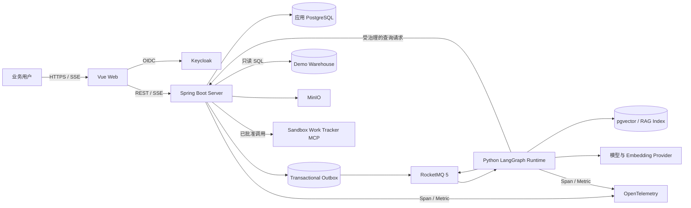

# AskMetric 系统架构

## 目标

AskMetric 是一个面向业务用户的 chat-first BI 产品，让用户无需编写 SQL 即可获得可验证分析。首版重点证明一条完整企业工作流，而不是追求连接器数量：一个 PostgreSQL 分析数据源、一个 B2B SaaS 参考场景、一个已配置模型，以及一个需要人工审批的 MCP 操作。

架构重点保证：

- Java 与 Python 的所有权清晰；
- 多轮工作可持久化并可恢复；
- 工作区隔离，数据访问可审计；
- 产出可重现分析，而不是不透明的聊天答案；
- 质量、延迟和模型成本均可度量；
- 一名开发者以每周 15–20 小时在 12 周内完成首版。

## 系统形态



Web 前端、Java 服务和 Python Runtime 是同一仓库中的三个独立部署应用。开发环境可以共用一个 PostgreSQL 实例，但应用状态、Agent Checkpoint/RAG 状态和演示数据仓库必须使用独立数据库或 Schema 及独立凭据。

## 仓库结构

```text
apps/
  web/          Vue 3 + TypeScript
  server/       Java 21 + Spring Boot
  agent/        Python 3.12 + LangGraph
contracts/      JSON Schema、AsyncAPI 和分析结果 Schema
evals/          评测用例、Fixture 和公开结果
infra/          Docker Compose 和部署配置
docs/           架构、ADR 和运维说明
```

## 状态所有权

| 所有者 | 权威状态 |
| --- | --- |
| Java | 用户、工作区成员关系、策略、对话、消息、Agent 运行、分析任务、审批、报告、审计记录、数据连接和语义元数据 |
| Python | LangGraph Checkpoint、临时上下文包、派生 RAG 索引和评测执行状态 |
| Vue | 仅临时展示状态 |
| Keycloak | 全局身份与认证 |
| 分析数据源 | 通过只读数据连接查询的业务事实 |

任何应用都不能读写其他应用的数据表。跨语言通信只使用版本化契约。

## Java 模块

Java 服务是一个 Spring Boot 模块化单体。Spring Modulith 校验以下模块的边界：

- `workspace`：成员关系、权限和策略；
- `conversation`：对话和不可变消息；
- `analysis`：任务、运行、事件和证据；
- `catalog`：数据连接、数据分级和指标定义；
- `knowledge`：知识来源元数据和摄取生命周期；
- `approval`：提案、审批和幂等执行；
- `report`：结构化分析和确定性 HTML 渲染；
- `audit`：受治理操作历史；
- `integration`：RocketMQ、面向模型的工具、MCP、MinIO 和 SSE Adapter。

模块 API 必须显式公开。常规模块依赖检查由 Spring Modulith 完成；只有当规则无法用 Modulith 表达时才添加 ArchUnit。

## 对话与任务模型

每条用户消息都会创建一次 Agent 运行。Agent 运行可以仅处理对话而不关联分析任务，因此问候和产品帮助不会产生虚假任务。

意图路由将本次运行分类为 `chat`、`analysis`、`task_control` 或 `approval`。明确命令使用确定性规则，不调用模型分类。遇到低置信度或任务目标冲突时必须询问用户，不能静默猜测。T08 引入 Analysis Task 后，Agent Run 通过 `analysisTaskId` 记录实际任务关联；任务创建、继续或切换由该关联及任务事件推导。

一个对话可以包含零个或多个分析任务。每个任务只表示一个持久分析目标，可以跨越多条消息和多次 Agent 运行。同一对话最多有一个活动任务，不同对话可以并行运行。

```text
分析任务：active -> waiting_for_input -> waiting_for_approval
                         |                   |
                         +-------> active <--+
                         |
                         +-------> completed | failed | cancelled

Agent 运行事件：accepted -> progress -> completed | failed | cancelled
```

## Agent 工作流

Python Runtime 使用一个有边界的 LangGraph 状态图：

1. 对消息进行意图分类，并决定是否需要创建或关联 Analysis Task；
2. 澄清存在歧义的目标或指标；
3. 生成显式分析计划；
4. 组装受预算约束的上下文包；
5. 检索指标定义和带引用的知识来源；
6. 生成 SQL，并提交给 Java Query Gateway；
7. 检查结果、验证假设，并在固定上限内重试；
8. 产出通过 Schema 校验的可审计分析；
9. 按需提交操作提案；
10. 发送结构化进度事件和终态事件。

状态图的循环次数有限，停止条件明确，不会动态创建专家 Agent。对话摘要和用户记忆只是派生输入，不能替代原始消息、指标事实、审批或证据。

## 可靠执行

Java 在一个数据库事务中提交 Agent 运行和 Outbox 记录。Publisher 定期领取带租约的 Outbox 记录，将版本化 JSON 事件发送到 RocketMQ 5；发布成功后标记完成，临时失败使用退避重试，超过上限后进入死信状态。相同请求事件使用稳定 eventId，发布器允许至少一次投递而不依赖 exactly-once。

消息采用 at-least-once 语义。事件信封包含 `eventId`、`schemaVersion`、`runId` 和序号。Java 消费 Python 事件时先写入 `agent_run_event`，由 `eventId`、聚合序号和生命周期迁移条件保证幂等与顺序；事务提交后从数据库按序向当前 SSE 连接补发缺失事件，内存不保存事件副本。重复 eventId、旧序号和乱序事件不会重复推进运行。用户提交消息时可提供 `Idempotency-Key`，Java 在用户、Workspace 和 Conversation 范围内保存请求指纹和首次响应，网络重试不会重复创建 Message、Agent Run 或 Analysis Task。重放从 Checkpoint 恢复，且不能重复执行已批准操作。

早期 T01 的直接创建 Agent Run 入口已移除；`/runs/{runId}/events` SSE 路径暂时保留，供 Conversation Agent Run 使用。业务 Conversation `/messages` 路径使用数据库 Agent Run 与 Transactional Outbox。

第一周技术探针必须在业务功能依赖该链路前，证明容器中的 Java -> RocketMQ -> Python -> RocketMQ -> Java 双向通信可用。

## 受治理的数据访问

Python 永远不接收数据连接凭据，也不直接连接分析数据源。它只能向 Java 发起查询请求，由 Java 执行以下控制：

- 使用 SQL AST 解析单条 `SELECT` 或只读 CTE；
- 只允许访问语义目录登记的 Schema、表和字段；
- 应用数据分级和工作区权限；
- 使用只读凭据和只读事务；
- 强制执行超时、行数、字节数和查询成本预算；
- 审计 SQL、参数、操作人、任务、耗时、行数和结果。

Restricted 数据永远不会进入 Python 或报告。Sensitive 数据根据工作区策略脱敏或聚合。证据快照只保留分析实际使用且策略允许的结果。

## 知识与上下文

Java 拥有知识来源的上传授权、元数据和生命周期，原始对象存放在 MinIO。Python 异步解析文本型 PDF、Markdown 和纯文本，并在 PostgreSQL/pgvector 中建立工作区级混合索引。检索段落一律是不可信证据：可以引用，但不能改变系统策略、批准操作或指定隐藏工具调用。

每次 Agent 运行都会获得一个有边界的上下文包，其中包含当前消息、任务状态、已确认事实、相关历史、指标定义、检索证据、裁剪后的工具结果、策略和剩余预算。版本化对话摘要必须标明覆盖的消息范围。只有经用户确认的偏好才能成为用户记忆。

## 分析报告

Python 返回经过校验的可审计分析，其中包含结论、指标和时间定义、证据、表格、受限图表模型、引用、不确定性、假设、建议以及可选操作提案。

Java 将该结构持久化为事实来源，再确定性地渲染为不可变、独立的 HTML 分析报告。模型不能提供任意 HTML、JavaScript 或 ECharts Option。重新分析会创建新报告，并通过 `supersedesReportId` 关联旧版本；现有报告不会静默刷新。

## 审批与 MCP

Python 可以提出副作用操作，但不能执行。Java 使用确切参数保存不可变操作提案。拥有权限的人工根据工作区策略批准该确切提案；参数发生任何变化都会使审批失效。Java 随后使用幂等键调用 Sandbox Work Tracker MCP Server，并记录结果。

演示工作区可以允许自审批。企业工作区默认要求另一名拥有 `approve_action` 权限的成员审批。公开访客不能连接外部系统。

## 安全

- Keycloak 负责认证；Java 根据当前工作区成员关系授权。
- 客户端提供的工作区 ID 永远不能授予访问权限。
- PostgreSQL Row-level Security 保护租户应用数据。
- 数据连接 Secret 使用部署密钥加密，不进入事件、日志、Trace 或 Python。
- 下载报告是显式且受审计的快照操作；首版不提供匿名分享。
- Prompt 和检索内容不能覆盖策略或审批。
- 演示数据为合成数据，调用受到频率和费用限制，并每日重置。

## 可观测性与评测

OpenTelemetry 使用同一个 Trace 串联浏览器请求、Java、RocketMQ、Python、模型调用、查询工具、MCP 和报告渲染。Java 还会持久化每次运行的模型名称、Prompt/工具 Schema 版本、Token、成本、延迟和业务结果。

评测优先使用确定性规则。意图路由、SQL 结果、引用、权限、状态流转、幂等和植入事件结论都使用断言；固定版本的 LLM Judge 只评估叙述完整性、不确定性披露和表达清晰度。Pull Request 运行离线测试，定时或手动任务运行依赖模型的评测集，并公开结果和已知失败。

## 部署边界

Docker Compose 是受支持的本地环境，也是单节点公开部署的基础。首版承诺进程重启后可恢复，不承诺零停机或多地域高可用。PostgreSQL/MinIO 的备份恢复流程必须记录并演练；Kubernetes 仅作为演进方向，不属于首版范围。

## 明确非目标

- 通用助手；
- 自动理解任意数据库；
- 写回源业务系统；
- Dashboard 或可视化语义建模器；
- Runtime Multi-Agent 讨论；
- 多模型自动路由；
- 多数据库连接器；
- OCR 和通用企业搜索；
- Kubernetes、多地域高可用或匿名报告分享。
